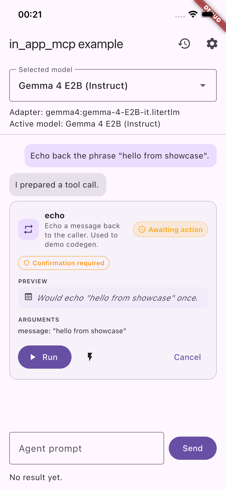
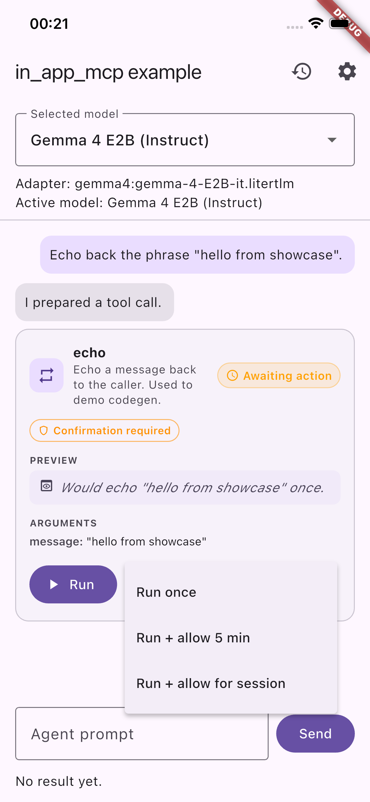
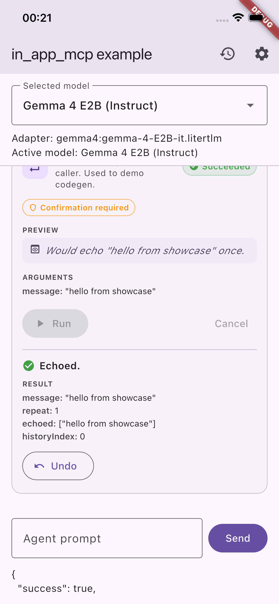
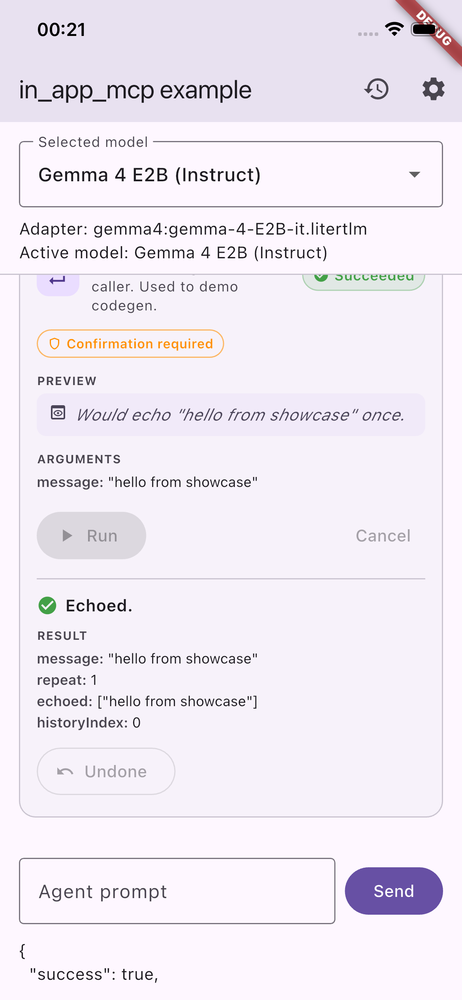
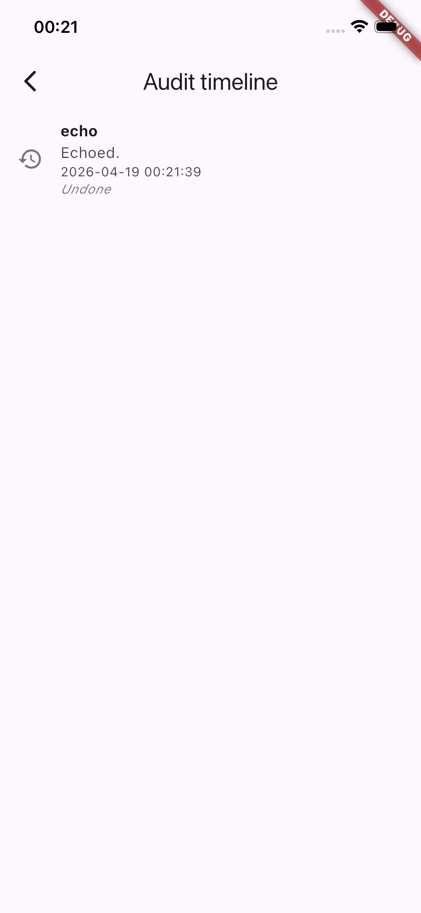

# in_app_mcp

**A policy-gated tool runtime for in-app LLM/agent tools.** Ships the full **Consent Lifecycle** — preview → ephemeral grant → execute → audit → undo — on top of a per-tool `auto` / `confirm` / `deny` gate that sits between the model's proposed `ToolCall` and any side effect in your app.

```
LLM adapter  ──►  ToolCall  ──►  preview  ──►  policy gate  ──►  argument validation  ──►  handler  ──►  audit ledger
                                  │              │                                              │           │
                                  │              └── auto / confirm / deny  (per-tool)          │           └── undo hook
                                  │                   + ephemeral grants (once / N min / sess.) │
                                  └── pure, no side effect — catches LLM mistakes early         └── structured ToolResult
```

- register typed tools with JSON-schema-style argument contracts
- resolve per-tool policy (stored or via ephemeral grant) from a pluggable `PolicyStore` / `GrantStore`
- short-circuit with `policy_denied` or `confirmation_required` *before* the handler runs
- execute and return a structured `ToolResult` with a centralized `ToolErrorCode`
- every outcome lands in an `AuditLedger`; successful calls can be reversed via a tool's optional `ToolUndoer`

> **Not the MCP wire protocol.** Despite the name, this package does not speak JSON-RPC / stdio / SSE. For that, see [`mcp_server`](https://pub.dev/packages/mcp_server) / [`mcp_client`](https://pub.dev/packages/mcp_client). `in_app_mcp` is a **local, in-process runtime** focused on the authorization boundary between a model's tool call and your app's side effects — usable with any LLM, any transport, or none at all.

## Why this package

Most Flutter agent/LLM packages focus on prompting, providers, and model orchestration. Policy and user consent are usually left as a developer-wired afterthought (`dart_agent_core`'s controller hooks are the closest comparable — developer-level, not user-facing).

`in_app_mcp` focuses on the execution boundary:
- typed tool contracts with top-level argument validation
- per-tool policy resolved at invoke time, not sprinkled through UI code
- `confirm` is a first-class runtime state, not just a dialog
- predictable `ToolResult` / `ToolErrorCode` shape, provider-neutral

## Current status

1.1.0 ships the full Consent Lifecycle.

What ships in the package:
- tool runtime in `lib/src/**` (registry, policy engine, invocation engine)
- ephemeral grants: `EphemeralGrant` + `GrantStore` + `InMemoryGrantStore` — allow-once, allow-for-duration, allow-until-cleared
- audit ledger: `AuditLedger` + `AuditEntry` + `InMemoryAuditLedger` with a live `changes` stream
- preview hook: `Preview` + `PreviewWarning` + `ToolPreviewer` typedef
- undo hook: `ToolUndoer` typedef + `InAppMcp.undoFromLedger`
- in-memory policy store (swap in your own `PolicyStore` for persistence)
- centralized `ToolErrorCode` constants
- `ToolDefinition.toJsonSchema()` + `InAppMcp.toolsSchemaJson()` for feeding tool catalogs to an LLM

What lives in the example app (not core, by design):
- policy settings UI + active-grants management card
- audit-timeline screen with per-entry undo
- inline tool-call card with preview section, grant submenu, and inline Undo
- mock LLM adapter + optional on-device Gemma 4 E2B adapter
- five demo tools (`schedule_weekday_alarm`, `create_calendar_event`, `open_map_directions`, `compose_email_draft`, codegen-backed `echo`); `schedule_weekday_alarm` and `echo` ship previewer + undoer as full-lifecycle examples
- companion codegen packages `in_app_mcp_annotations` + `in_app_mcp_gen` with new `@McpToolPreview` and `@McpToolUndo` annotations

What is intentionally not in core:
- provider-specific LLM SDK coupling
- persistent policy / grant / audit store implementations
- broad native capability catalog
- MCP wire protocol (JSON-RPC / stdio / SSE) — out of scope

## Installation

Add dependency:

```yaml
dependencies:
  in_app_mcp: ^1.0.1
```

Then run:

```bash
flutter pub get
```

## Quick start

```dart
import 'package:in_app_mcp/in_app_mcp.dart';

final mcp = InAppMcp(defaultPolicy: ToolPolicy.confirm);

mcp.registerTool(
  definition: const ToolDefinition(
    name: 'echo',
    description: 'Echo message back',
    argumentTypes: {
      'message': ToolArgType.string,
    },
    requiredArguments: {'message'},
    allowAdditionalArguments: false,
  ),
  handler: (call) async {
    return ToolResult.ok('ok', data: {'echo': call.arguments['message']});
  },
);

final call = ToolCall(
  id: '1',
  toolName: 'echo',
  arguments: {'message': 'hello'},
);

final result = await mcp.handleToolCall(call, confirmed: true);
print(result.toJson());
```

## Runtime flow

1. LLM adapter produces `ToolCall`
2. `InAppMcp` resolves policy for `toolName`
3. If denied → `policy_denied`
4. If confirmation required and not confirmed → `confirmation_required`
5. Registry validates arguments
6. Handler executes and returns `ToolResult`

## Tool-call showcase

Every tool registered with `InAppMcp` is proposed to the user as an inline
**tool-call card** — the runtime's policy gate is part of the UX, not a
hidden step. The screenshots below are produced automatically by
`example/integration_test/tool_showcase_test.dart` driving **Gemma 4 E2B
on-device** on a booted iPhone simulator. The prompts are natural
language — no tool names, no argument schemas — so each card is evidence
that Gemma *inferred* the correct tool from a real user sentence.

| Prompt (as typed by the user) | Gemma's tool-call proposal |
| :--- | :--- |
| *"Wake me up at 6 AM every weekday."* |  |
| *"Put a Team Sync meeting on my calendar tomorrow from 10 AM to 11 AM at the Main Office."* |  |
| *"How do I drive to Tokyo?"* |  |
| *"Draft an email to team@example.com saying hello from the in_app_mcp demo."* |  |
| *"Echo back the phrase "hello from showcase"."* — routed to the codegen-backed `echo` tool (built from an annotated Dart function by `in_app_mcp_gen`). |  |

Each card shows the tool icon, a plain-English description, the current
**status chip** (amber `Awaiting action` above), the resolved **policy
chip** (`Confirmation required` for the default `confirm` policy), and
the structured arguments Gemma proposed. Nothing executes until the user
taps **Run**.

> **Why the policy gate matters, illustrated by the calendar card above:**
> Gemma filled in `startIso: "<tomorrow's date>T10:00:00"` — a literal
> placeholder, not a resolved timestamp. A naive agent that ran the tool
> immediately would put garbage on the user's calendar. The inline card
> surfaces the proposed arguments *before* the handler runs, so the user
> can catch this and either edit or cancel. This is exactly the class of
> LLM mistake the runtime's policy/consent layer is designed to contain.

### Result rendering after Run

Tapping **Run** invokes `InAppMcp.handleToolCall(..., confirmed: true)`,
the handler fires, and the card updates with the structured `ToolResult`:


The status chip flips to green `Succeeded`, the returning `message`
("Echoed.") appears with a check icon, and `data` is rendered as a
key-value block (`message`, `repeat`, `echoed`) — the same shape the
codegen-generated handler returns from the annotated Dart function.

## Consent Lifecycle showcase

The screenshots below are captured end-to-end from the same
Gemma-on-simulator flow, driving a **single natural-language prompt** —
*"Echo back the phrase 'hello from showcase'"* — through the four
consent-lifecycle layers in order. Each card is a real frame from
[`example/integration_test/consent_lifecycle_showcase_test.dart`](example/integration_test/consent_lifecycle_showcase_test.dart),
not a mockup.

### 1 — Preview before Run



The inline card gained a **Preview** row: *"Would echo 'hello from
showcase' once."* That line is produced by the tool's `@McpToolPreview`
function (codegen'd from an annotated Dart function) and surfaced *before*
the handler runs. It's the first place an LLM mistake is caught — if
Gemma had fabricated the arguments, the preview would render the
fabrication in plain English and the user would decline.

### 2 — Ephemeral grant submenu



Tapping the lightning icon beside **Run** opens a submenu with three
choices:

- **Run once** — execute this single call, don't change stored policy
- **Run + allow 5 min** — drop an `EphemeralGrant.forDuration` so any
  subsequent call to the same tool runs without prompting for 5 minutes
- **Run + allow for session** — `EphemeralGrant.untilCleared`, active
  until the host app calls `revokeGrant` / `revokeAllGrants`

Grants override stored policy at invocation time and are consumed by
`PolicyEngine.decide` — the core Cursor-/Claude-Desktop-style pattern
that no other Flutter MCP or agent package ships. See
[`ephemeral_grant.dart`](lib/src/runtime/grant_store.dart).

### 3 — Succeeded with inline Undo



After the handler completes, the runtime appended one `AuditEntry` to the
ledger. The chat screen listens on `auditLedger.changes` and attaches the
entry's id to the card, which reveals the **Undo** button. Tapping it
calls `mcp.undoFromLedger(entryId)`, which locates the registered
`@McpToolUndo` function and runs it with the original `ToolCall` + the
original `ToolResult`.

### 4 — Undone



Undo complete. The runtime marks the ledger entry undone with the
undoer's result, and the button flips to **Undone** (disabled). For
`echo` the reverse side effect is a synthesised history retraction;
for a real scheduling tool it's `flutter_local_notifications.cancel`,
for a messaging tool it's an outbox deletion, etc. The contract is up to
the tool — `in_app_mcp` just gives you the trip-wire + the undoer plumbing.

### 5 — Audit timeline



Every call — successes, policy denials, validation failures, missing
tools — lands in an `AuditLedger`. The **Audit timeline** screen
(`history` icon in the app bar) subscribes to `auditLedger.changes` and
renders entries newest-first with per-entry **Undo** for anything still
revertable. The "Undone" italic below the echo entry reflects the state
produced by step 4.

To reproduce these screenshots yourself:

```bash
cd example
./scripts/capture_consent_showcase.sh
```

The script runs the test against the currently-booted iPhone simulator,
tails its `[SCREENSHOT:<name>]` markers, and writes PNGs into
`doc/screenshots/` via `xcrun simctl io booted screenshot`.

## End-to-end on iOS simulator (Gemma 4 E2B)

The flow above works identically with a real on-device LLM. Drive it with
Gemma 4 E2B via [`flutter_litert_lm`](https://pub.dev/packages/flutter_litert_lm):

```bash
# 1. Cache the model once.
cd example
./scripts/precache_gemma_e2b.sh

# 2. Launch on the simulator.
flutter run -d <booted-simulator-id> \
  --dart-define=LLM_ADAPTER=gemma \
  --dart-define=GEMMA_MODEL_PATH=$PWD/model_cache/gemma-4-E2B-it.litertlm
```

The iOS simulator can read the absolute Mac path directly — no in-sandbox
re-download is needed.

Three automated flows verify the end-to-end behaviour on the simulator:

```bash
# Gemma-backed run of the codegen echo tool (prompt → tool call → run →
# Succeeded). ~40–60 s end-to-end; most of it is Gemma's first inference.
flutter test -d <booted-simulator-id> \
  integration_test/gemma_echo_flow_test.dart \
  --dart-define=LLM_ADAPTER=gemma \
  --dart-define=GEMMA_MODEL_PATH=$PWD/model_cache/gemma-4-E2B-it.litertlm

# Per-tool showcase that re-generates the tool-call screenshots above by
# driving Gemma with natural-language prompts (~5–8 min, six cold-starts).
flutter test -d <booted-simulator-id> \
  integration_test/tool_showcase_test.dart \
  --dart-define=LLM_ADAPTER=gemma \
  --dart-define=GEMMA_MODEL_PATH=$PWD/model_cache/gemma-4-E2B-it.litertlm

# Consent Lifecycle showcase — regenerates the five consent_* screenshots
# by driving Gemma through preview → grant menu → execute → undo → audit.
# ~1 min end-to-end (single prompt, one Gemma cold-start).
./scripts/capture_consent_showcase.sh
```

All three tests print `[SCREENSHOT:<name>]` markers on stdout;
`capture_consent_showcase.sh` already drives `xcrun simctl io booted
screenshot` off those markers. For the other two, see `example/README.md`
for the one-liner watcher.

## Public API surface

### Models
- `ToolCall`
- `ToolDefinition`, `ToolArgType`
- `ToolResult`
- `ToolErrorCode`
- `Preview`, `PreviewWarning`

### Runtime
- `InAppMcp` — facade
- `ToolPolicy`, `PolicyDecision`, `PolicySource`, `ResolvedPolicy`
- `PolicyStore`, `InMemoryPolicyStore`
- `GrantStore`, `InMemoryGrantStore`, `EphemeralGrant`
- `AuditLedger`, `InMemoryAuditLedger`, `AuditEntry`
- `ToolRegistry`, `RegisteredTool`, `ToolPreviewer`, `ToolUndoer`
- `InvocationEngine`

## Error codes

`ToolErrorCode` includes:
- `tool_not_found`, `invalid_arguments`
- `policy_denied`, `confirmation_required`
- `audit_disabled`, `entry_not_found`, `already_undone`, `nothing_to_undo`, `undo_not_supported`

## Example app

The example app lives under `example/` and demonstrates:
- user policy selection (`Auto`, `Confirm`, `Deny`)
- active-grants management (list + revoke + revoke all)
- audit timeline with per-entry undo
- inline tool-call card with **preview**, **grant submenu** (once / 5 min / session), and inline **Undo** after success
- mock LLM adapter + optional on-device Gemma 4 E2B
- five demo tools, with `schedule_weekday_alarm` and `echo` wiring the full preview + undo lifecycle

Run it:

```bash
cd example
flutter pub get
flutter run
```

## Testing

From package root:

```bash
flutter analyze
flutter test test
```

Example app checks:

```bash
cd example
flutter analyze
flutter test
```

## Security notes

- Do not hardcode API keys in source.
- Treat tool handlers as side-effect boundaries; validate external inputs.
- Keep risky tools behind `confirm` or `deny` by default.
- OS-level permission prompts are still required where platform policies demand them.

## Roadmap

Planned next steps:
- persistent `PolicyStore` (SharedPreferences-backed) as a companion package
- persistent `AuditLedger` (sqflite-backed) as a companion package
- richer argument schema/validators (e.g. `array<int>` semantics in core)
- optional provider adapters (Grok/OpenAI/etc.) in example or side packages
- federated capability plugins for reminders/calendar/contacts

## Documentation

See:
- `doc/architecture.md`
- `doc/api.md`
- `doc/example_workflow.md`
