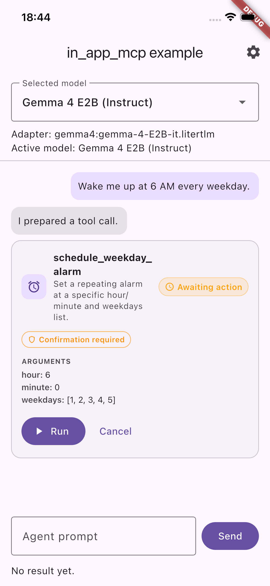
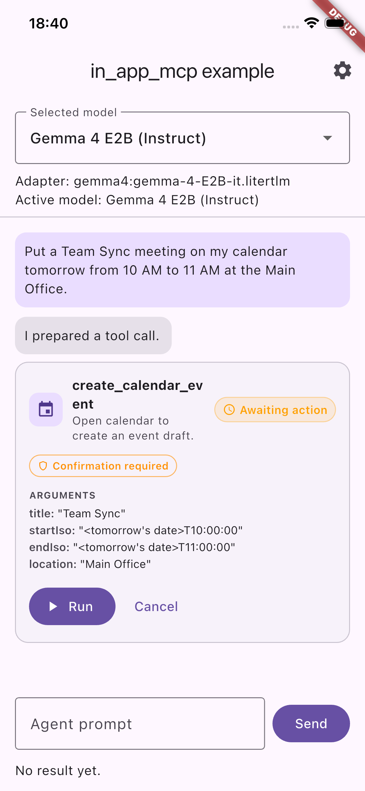
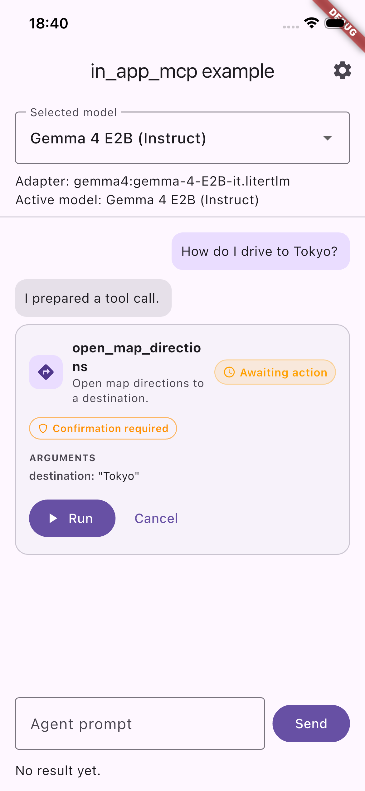
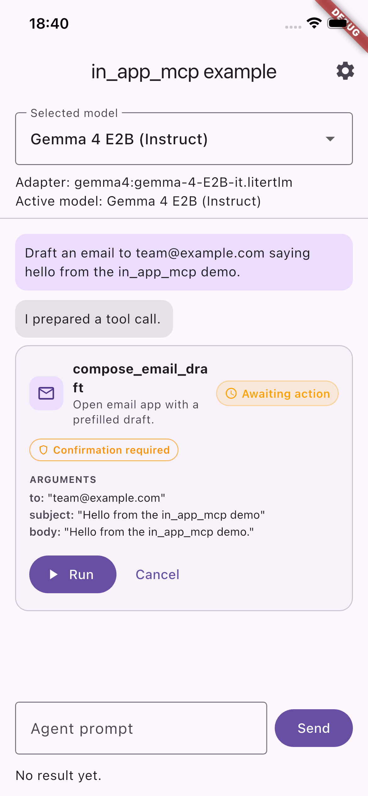
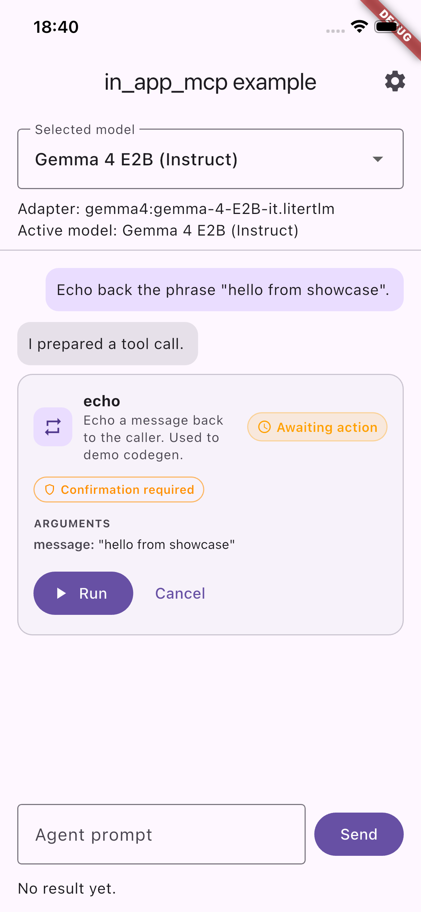
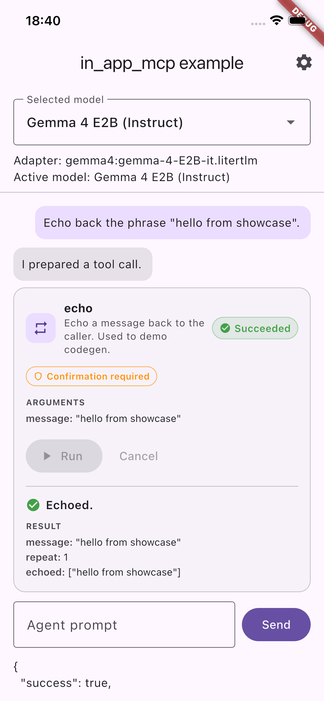

# in_app_mcp

`in_app_mcp` is a Flutter package for executing **in-app agent tool calls** with policy controls.

It is designed as the runtime layer between an LLM/chat agent and your app capabilities:
- register tools
- validate arguments
- enforce user policy (`auto`, `confirm`, `deny`)
- execute handlers and return structured results

The current MVP includes a complete runtime API and an example app that demonstrates scheduling weekday alarms through a tool call flow.

## Why this package

Most Flutter AI packages focus on prompting and model orchestration. Most scheduling packages focus on notifications/alarms only.

`in_app_mcp` focuses on the execution boundary:
- typed tool contracts
- runtime validation
- policy/consent enforcement
- predictable result/error payloads

## Current status

MVP runtime is implemented.

What exists today:
- core tool runtime in `lib/src/**`
- in-memory policy store
- centralized error codes
- example app with:
  - policy settings UI
  - mock LLM adapter
  - one tool: `schedule_weekday_alarm`

What is intentionally not in core yet:
- provider-specific LLM SDK coupling
- persistent policy store implementation
- broad native capability catalog

## Installation

Add dependency:

```yaml
dependencies:
  in_app_mcp: ^0.0.1
```

Then run:

```bash
flutter pub get
```

## Quick start

```dart
import 'package:in_app_mcp/in_app_mcp.dart';

final mcp = InAppMcp(defaultPolicy: ToolPolicy.confirm);

mcp.registerTool(
  definition: const ToolDefinition(
    name: 'echo',
    description: 'Echo message back',
    argumentTypes: {
      'message': ToolArgType.string,
    },
    requiredArguments: {'message'},
    allowAdditionalArguments: false,
  ),
  handler: (call) async {
    return ToolResult.ok('ok', data: {'echo': call.arguments['message']});
  },
);

final call = ToolCall(
  id: '1',
  toolName: 'echo',
  arguments: {'message': 'hello'},
);

final result = await mcp.handleToolCall(call, confirmed: true);
print(result.toJson());
```

## Runtime flow

1. LLM adapter produces `ToolCall`
2. `InAppMcp` resolves policy for `toolName`
3. If denied → `policy_denied`
4. If confirmation required and not confirmed → `confirmation_required`
5. Registry validates arguments
6. Handler executes and returns `ToolResult`

## Tool-call showcase

Every tool registered with `InAppMcp` is proposed to the user as an inline
**tool-call card** — the runtime's policy gate is part of the UX, not a
hidden step. The screenshots below are produced automatically by
`example/integration_test/tool_showcase_test.dart` driving **Gemma 4 E2B
on-device** on a booted iPhone simulator. The prompts are natural
language — no tool names, no argument schemas — so each card is evidence
that Gemma *inferred* the correct tool from a real user sentence.

| Prompt (as typed by the user) | Gemma's tool-call proposal |
| :--- | :--- |
| *"Wake me up at 6 AM every weekday."* |  |
| *"Put a Team Sync meeting on my calendar tomorrow from 10 AM to 11 AM at the Main Office."* |  |
| *"How do I drive to Tokyo?"* |  |
| *"Draft an email to team@example.com saying hello from the in_app_mcp demo."* |  |
| *"Echo back the phrase "hello from showcase"."* — routed to the codegen-backed `echo` tool (built from an annotated Dart function by `in_app_mcp_gen`). |  |

Each card shows the tool icon, a plain-English description, the current
**status chip** (amber `Awaiting action` above), the resolved **policy
chip** (`Confirmation required` for the default `confirm` policy), and
the structured arguments Gemma proposed. Nothing executes until the user
taps **Run**.

> **Why the policy gate matters, illustrated by the calendar card above:**
> Gemma filled in `startIso: "<tomorrow's date>T10:00:00"` — a literal
> placeholder, not a resolved timestamp. A naive agent that ran the tool
> immediately would put garbage on the user's calendar. The inline card
> surfaces the proposed arguments *before* the handler runs, so the user
> can catch this and either edit or cancel. This is exactly the class of
> LLM mistake the runtime's policy/consent layer is designed to contain.

### Result rendering after Run

Tapping **Run** invokes `InAppMcp.handleToolCall(..., confirmed: true)`,
the handler fires, and the card updates with the structured `ToolResult`:



The status chip flips to green `Succeeded`, the returning `message`
("Echoed.") appears with a check icon, and `data` is rendered as a
key-value block (`message`, `repeat`, `echoed`) — the same shape the
codegen-generated handler returns from the annotated Dart function.

## End-to-end on iOS simulator (Gemma 4 E2B)

The flow above works identically with a real on-device LLM. Drive it with
Gemma 4 E2B via [`flutter_litert_lm`](https://pub.dev/packages/flutter_litert_lm):

```bash
# 1. Cache the model once.
cd example
./scripts/precache_gemma_e2b.sh

# 2. Launch on the simulator.
flutter run -d <booted-simulator-id> \
  --dart-define=LLM_ADAPTER=gemma \
  --dart-define=GEMMA_MODEL_PATH=$PWD/model_cache/gemma-4-E2B-it.litertlm
```

The iOS simulator can read the absolute Mac path directly — no in-sandbox
re-download is needed.

Two automated flows verify the end-to-end behaviour on the simulator:

```bash
# Gemma-backed run of the codegen echo tool (prompt → tool call → run →
# Succeeded). ~40–60 s end-to-end; most of it is Gemma's first inference.
flutter test -d <booted-simulator-id> \
  integration_test/gemma_echo_flow_test.dart \
  --dart-define=LLM_ADAPTER=gemma \
  --dart-define=GEMMA_MODEL_PATH=$PWD/model_cache/gemma-4-E2B-it.litertlm

# Per-tool showcase that re-generates the screenshots above by driving
# Gemma with natural-language prompts (~5–8 min, six Gemma cold-starts).
flutter test -d <booted-simulator-id> \
  integration_test/tool_showcase_test.dart \
  --dart-define=LLM_ADAPTER=gemma \
  --dart-define=GEMMA_MODEL_PATH=$PWD/model_cache/gemma-4-E2B-it.litertlm
```

Both tests print `[SCREENSHOT:<name>]` markers on stdout so a shell
watcher can drive `xcrun simctl io booted screenshot` at each key state —
see `example/README.md` for the one-liner.

## Public API surface

### Models
- `ToolCall`
- `ToolDefinition`
- `ToolArgType`
- `ToolResult`
- `ToolErrorCode`

### Runtime
- `InAppMcp`
- `ToolPolicy`
- `PolicyDecision`
- `PolicyStore`
- `InMemoryPolicyStore`
- `ToolRegistry`
- `InvocationEngine`

## Error codes

`ToolErrorCode` currently includes:
- `tool_not_found`
- `invalid_arguments`
- `policy_denied`
- `confirmation_required`

## Example app

The example app lives under `example/` and demonstrates:
- user policy selection (`Auto`, `Confirm`, `Deny`)
- mock user prompt → mock tool call
- optional confirmation dialog when policy is `confirm`
- scheduling a weekday alarm notification tool

Run it:

```bash
cd example
flutter pub get
flutter run
```

## Testing

From package root:

```bash
flutter analyze
flutter test test
```

Example app checks:

```bash
cd example
flutter analyze
flutter test
```

## Security notes

- Do not hardcode API keys in source.
- Treat tool handlers as side-effect boundaries; validate external inputs.
- Keep risky tools behind `confirm` or `deny` by default.
- OS-level permission prompts are still required where platform policies demand them.

## Roadmap

Planned next steps:
- persistent policy store (e.g. SharedPreferences-backed)
- richer argument schema/validators (e.g. `array<int>` semantics in core)
- optional provider adapters (Grok/OpenAI/etc.) in example or side packages
- federated capability plugins for reminders/calendar/contacts
- audit/event hooks for observability

## Documentation

See:
- `doc/architecture.md`
- `doc/api.md`
- `doc/example_workflow.md`
